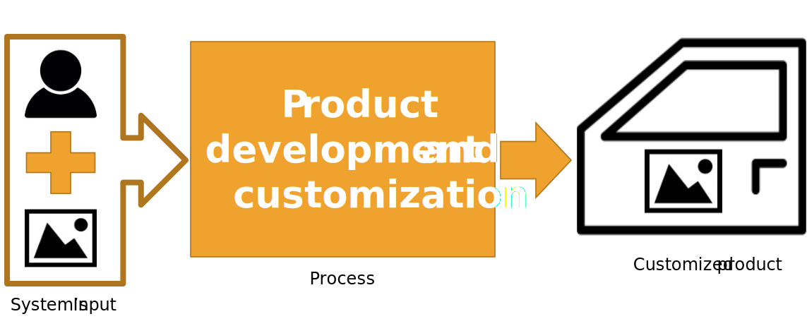

# ABB 140 Robot Draws a Given Picture
This project takes an image as an input and processes it to create a custom drawing. 


Look at a video of the simulation in VREP now CoppeliaSim.

[](http://www.youtube.com/watch?v=eBD8MeGVFI8 "ABB 140 Drawing in VREP")

And the implementation in the real robot.

[](http://www.youtube.com/watch?v=cmtysZaNMQg "Robot arm ABB140 Drawing a custom image")

Sample of the obtained drawing in the real robot

<p align="center">


</p>

It is not the best, but the algorithm can be improved.

## Explanation and uses

This idea can be applied to customize/individualize products in mass.

<p align="center">

</p>

This project uses:
* Image processing (Input image)
* Trajectory optimization (Draw)
* Inverse Kinematics (Robot Arm)
 
This project proposes implementing the real robot's obtained results using its proprietary language **RAPID**, bringing a **self-generated code** to get this result. (USE THIS FEATURE WITH **CAUTION**, IN THIS CASE, THE CODE IS OPTIMIZE TO THE FEATURES/CONFIGURATION/CALIBRATION OF THE ROBOT I AM USING)

### Image processing

The image processing tries to obtain the edges of the image.

<p align="center">

</p>

## Trajectory optimization (Draw)

Then the problem is taken as an optimization problem, as follows:

<p align="center">

</p>


The trajectory looks like this:

<p align="center">

</p>


## Inverse Kinematics

* It is possible to control the robot with the global coordinate system.
* The use of Inverse Kinematics on the robot is not required.
* A “Dummy” point may be a reference point that would be the starting point of the work area.

Dummy point:

<p align="center">

</p>

The implementation of kinematics in VREP needs:
* Create an associated SERVER in the API using TCP / IP on the host.
* Create a class constructor for each of the objects to be used
* Modify the position of the associated object in the robot's final tool or effector

## Overview of the project

<p align="center">

</p>


## RAPID code generator

1. Understand the structure and syntax of RAPID code
2. Abstractly generate a code template that can be executed in any case.
3. Create the template in text form in the desired language (considering the possible changes in the code in the different requirements).
4. Adjust and implement the code.

Used template:

<p align="center">

</p>


-------------------------------------
-------------------------------------

# How to use this code

## Be sure you installed CoppeliaSim/ V-REP, and you have the correct API files

VREP/CoppeliaSim, these files are included in the software (provided API by Coppelia):

Make sure you have the following files in your directory:
1. vrep.py
2. vrepConst.py
3. the appropriate remote API library: 
        "remoteApi.dll" (Windows), "remoteApi.dylib" (Mac) or "remoteApi.so" (Linux)
    
    In Windows, you can find them on:
    C:\Program Files\CoppeliaRobotics\CoppeliaSimEdu\programming\remoteApiBindings\lib\lib

(This information was obtained from the simulator examples)

# Requirements

I worked with the next libraries:

```
opencv-python == 4.1.1.26
numpy == 1.17.1
tsp-solver == 0.1
```

# Running the program

1. Open the ABB140_Draws.ttt and press Play
2. Go to the Source_Code folder
3. Run the code ABB140_control.py
4. If you want to change the input image file, put it on the Image folder in the Source_Code folder and be sure of use its name on the ABB140_control.py program.

It should work without any additional configuration.
